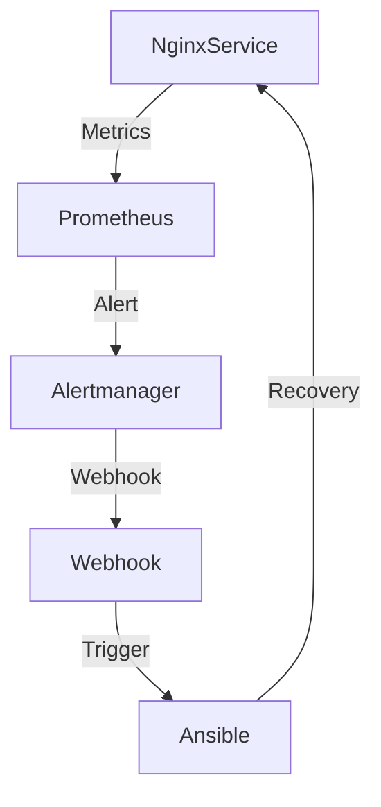
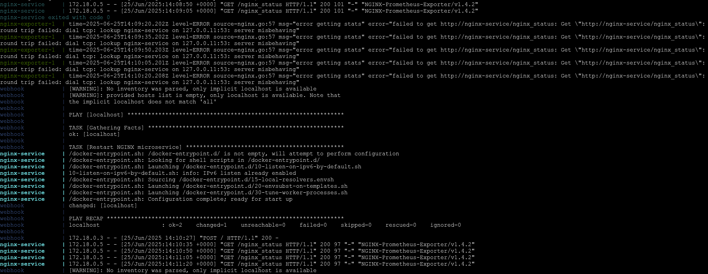

# Self-Healing Microservices Infrastructure

## Overview

This project is a demonstration of a **self-healing microservices system** using modern cloud-native tools and automation frameworks. Its core purpose is to ensure that if a critical microservice (such as an NGINX server) fails, the system will automatically detect the failure and restore the service without human intervention. The entire stack is orchestrated using Docker Compose, simulating a real-world microservices environment.

---

## Architecture at a Glance

**Key Workflow:**
1. **Continuous Monitoring:**  
   Prometheus continuously scrapes health and performance metrics from the microservices (e.g., NGINX via an exporter).
2. **Alerting on Failure:**  
   If a service becomes unhealthy or unreachable, Prometheus evaluates alert rules and fires an alert.
3. **Centralized Alert Routing:**  
   Alertmanager receives the alert and routes it according to its configuration, in this case sending it to a custom webhook.
4. **Automated Remediation:**  
   The webhook, implemented in Python using Flask, receives the alert and executes an Ansible playbook.
5. **Service Recovery:**  
   The Ansible playbook performs recovery actions, such as restarting the failed NGINX container.
6. **Closed Feedback Loop:**  
   The system continues monitoring, and once the service recovers, alerts are resolved and healthy state is restored.

---

## Components and Their Roles

### 1. **NGINX Microservice**
- Acts as a sample microservice to be monitored and recovered.
- Exposes a special `/nginx_status` endpoint for health metrics.

### 2. **Prometheus**
- Scrapes metrics from the NGINX exporter at regular intervals.
- Evaluates configured alerting rules to determine if the service is down for a sustained period.
- Sends alerts to Alertmanager when rules are triggered.

### 3. **NGINX Prometheus Exporter**
- Bridges NGINX’s stub_status metrics to Prometheus format.
- Allows Prometheus to monitor NGINX health and status.

### 4. **Alertmanager**
- Receives alerts from Prometheus.
- Groups, deduplicates, and routes alerts to the correct receiver.
- Forwards alerts to a webhook when NGINX is detected as down.

### 5. **Webhook (Flask + Ansible)**
- Acts as the glue between monitoring/alerting and automated remediation.
- Receives POST requests from Alertmanager.
- Triggers the Ansible playbook to attempt recovery.

### 6. **Ansible**
- Executes the desired remediation actions (e.g., restarting the NGINX Docker container).
- Can be extended to handle more complex recovery or multi-service orchestration.

### 7. **Docker Compose**
- Orchestrates all the above components as isolated containers on a shared network.
- Makes it easy to launch, stop, and manage the entire stack for testing or demonstration.

---

## System Workflow

1. **Normal Operation:**  
   - All containers are running.
   - Prometheus scrapes NGINX exporter for metrics indicating service health.

2. **Failure Occurs:**  
   - NGINX service is stopped or crashes.
   - Exporter can no longer scrape metrics; Prometheus sees the service as "down".

3. **Alert Triggered:**  
   - Prometheus detects outage based on alert rules (e.g., service down for >30 seconds).
   - An alert is generated and immediately sent to Alertmanager.

4. **Alert Routed:**  
   - Alertmanager receives the alert and forwards it to the webhook endpoint according to its routing rules.

5. **Webhook Activates Automation:**  
   - The webhook receives the alert as a POST request.
   - It triggers an Ansible playbook execution.

6. **Automated Recovery:**  
   - Ansible attempts to restart the failed NGINX container.
   - If restart is successful, the NGINX service resumes operation.

7. **Self-Healing Feedback:**  
   - Prometheus detects the NGINX service is healthy again.
   - The alert is resolved, and Alertmanager sends a resolved notification.

## **Workflow Diagram**

---

## Logs

All critical logs generated during the self-healing process are captured for troubleshooting and transparency.

- **Location:** See [`logs.txt`](https://github.com/ObsidianMaximus/Infra-Sentinel/blob/master/logs.txt) in this repository for a full sample of the system logs, including alert triggers, webhook activations, and Ansible recovery output.

- **Sample Screenshot:**  
  

The logs provide a clear trace from the initial microservice failure, through alerting and automated remediation, to successful recovery. Reviewing them can help you understand the end-to-end workflow and debug any issues.

---

## Extending This Pattern

- **Multiple Microservices:**  
  Add more services and exporters, expanding alert rules and playbooks for each.
- **Advanced Recovery:**  
  Playbooks can be extended to handle rolling restarts, container replacements, or even cloud-native operations (e.g., scaling, redeployment).
- **Remote Infrastructure:**  
  Ansible can target remote hosts, enabling self-healing for distributed or hybrid environments.
- **Custom Alert Routing:**  
  Alertmanager can be configured to notify multiple channels (e.g., Slack, email) alongside automation.

---

## Benefits and Use Cases

- **Resilience:**  
  Automated detection and remediation minimize downtime and manual intervention.
- **Observability:**  
  Prometheus and Alertmanager provide clear visibility into system health and alert history.
- **Modularity:**  
  Each component can be swapped or scaled independently.
- **Extensibility:**  
  Easily adapt for more complex services, clusters, or cloud environments.

---

## Summary

This solution provides a robust foundation for self-healing microservices in any environment, demonstrating how modern monitoring, alerting, and automation tools can work together to achieve true zero-touch operations.  
Experiment, extend, and make your infrastructure resilient by design!

